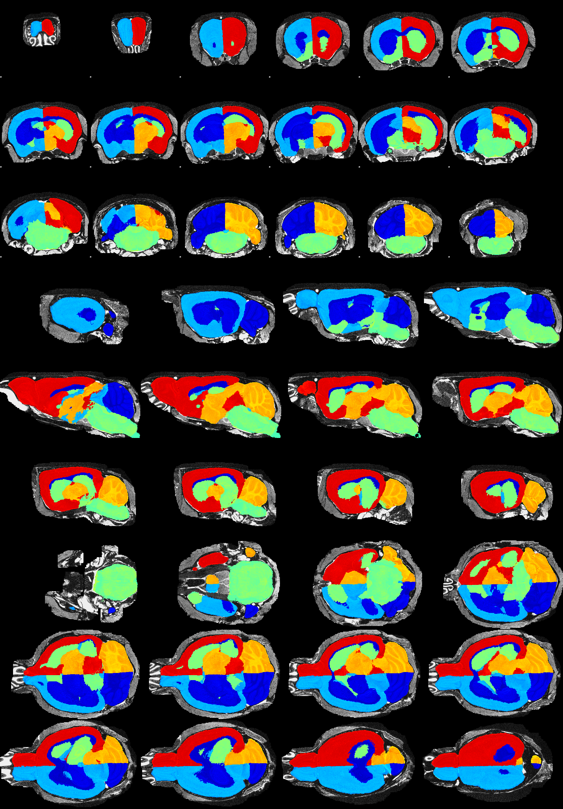

Multi Atlas Segmentation (MAS) for mouse brain MRI
================================================

Author: Da Ma d.ma.11@ucl.ac.uk, da_ma@sfu.ca

**Description**

This bash scripts is created for "Multi-atlas based automatic brain structural parcellation", mainly for mouse brain MRI. Prerequisite: NityReg and NitySeg packages (both open-source, details can be found on page: http://cmictig.cs.ucl.ac.uk/research/software/software-nifty).

The bash script is compatible to Linux/Windows/Mac. For detailed description of the pipeline, with proper setup, and download link for the mouse brain atlas, please go the the website: http://cmic.cs.ucl.ac.uk/staff/da_ma/Multi_Atlas/

(This script is also capable of handelling for multi-atlas-based human brain parcellation, with appropriate human-brain atlas.)

**Usage**

There is only one main script: *MASHelperFunctions.sh* which is capable of handling batch brain parcellation (functions with suffix `_batch`) either on the local workstation or on PBS cluster (by simply specifying the `-e` flag as either `local` or `cluster`).  
To use the script, simply type `source MASHelperFunctions.sh` to load all corresponding functions.

To get help for each function, type `function_name -h`.
For example: `mas_mapping -h`

**List of functions**

[Basic functions]
- `check_image_file`
- `check_atlas_file`
- `check_mapping_file`
- `check_label_fusion_file`

[Single image processing functions]
- `mas_mapping` (prerequisite: NiftyReg): single atlas label propagation
- `mas_fusion` (prerequisite: NiftySeg): multi atlas label fusion
- `mas_quickcheck` (prerequisite: FSL): quality control (quickcheck) image generator
- `mas_label_volume` (prerequisite: NiftySeg): extract label volume (into a .csv file)
- `mas_template_function`: template functions for advanced user to develop your own additional functions

[Batch image processing functions]:
- `mas_mapping_batch`
- `mas_fusion_batch`
- `mas_quickcheck_batch`
- `mas_parcellation_batch` (label propogations + label fusions)
(The parallel brain structure parcellation on PBS cluster is achieved through PBS array and PBS dependency.)

[ "Click for sample quality control image of the parcellation output (generated using mas_quickcheck). The similar color between the olfactory bulb and the cortex is due to the limited colormap of `jet`."](docs/quickcheckdemo.png)

**Older implementation in previous version (will be removed in future release)**

- for_single_workstation: to be used on a single PC.
- for_cluster: to be run on computer cluster, use parallel image registration to speed-up the process.
- parameter_samples: sample parameter files that can be fed to the command when running the script [optional].

**Q/A**

- Q. What image orientation should my test image be?

  A. The orientation of the default atlas is: RAS.
  If you have FreeSurfer installed, `use mri_convert --in_orientation $input_orientation --out_orientation $output_orientation -ot nifti -odt float $input_image $output_image`.
  Alternatively, if you use matlab, the script orient_nii.m uses the Matlab NIfTI toolbox (https://www.mathworks.com/matlabcentral/fileexchange/8797-tools-for-nifti-and-analyze-image) to visualize and determine the orientation, as well as reorient it. 

- Q. Why is my parcellation not properly overlayed with the original image?

  A. Check if your MR image has been properly oriented to RAS (See the Q/A above). If that's not the problem, then make sure your MR image has been preprocessed to correct the bias field correction (also called bias field). There are several tools that can perform the bias field correction:
    
    (1) The FreeSurfer package (https://surfer.nmr.mgh.harvard.edu/) provide a tool (**nu_correct**) which uses N3 bias field correction algorithm.
    
    (2) The NiftySeg package (http://cmic.cs.ucl.ac.uk/staff/da_ma/Multi_Atlas/) provide bias field correction using automatic tissue segmentation (**seg_EM**).
    
    (3) The ANTs tools (http://stnava.github.io/ANTs/) provide a handy bias field correction function (**N4BiasFieldCorrection**) which used an upgrade version of the N3 algorithm as used in the FreeSurfer's nu_correct, and it can handle the nifti format out-of-the-box as it's using the ITK framework.
    
    (4) The 3D-slicer (https://www.slicer.org/wiki/Documentation/4.3/Modules/N4ITKBiasFieldCorrection) also provide the N4ITK through command line interface (CLI) (**N4BiasFieldCorrection**).

**Citation**

Ma D, Holmes HE, Cardoso MJ, Modat M, Harrison IF, Powell NM, O'Callaghan J, Ismail O, Johnson RA, O’Neill MJ, Collins EC. **Study the longitudinal in vivo and cross-sectional ex vivo brain volume difference for disease progression and treatment effect on mouse model of tauopathy using automated MRI structural parcellation.** Frontiers in Neuroscience. 2019;13:11.

Ma, D., Cardoso, M. J., Modat, M., Powell, N., Wells, J., Holmes, H., … Ourselin, S. (2014). **Automatic Structural Parcellation of Mouse Brain MRI Using Multi-Atlas Label Fusion.** PLoS ONE, 9(1), e86576.
[http://journals.plos.org/plosone/article?id=10.1371/journal.pone.0086576]

Ma D, Cardoso M, Modat M, Powell N, Holmes H, Lythgoe M, Ourselin S. **Multi atlas segmentation applied to in vivo mouse brain MRI.** MICCAI 2012 Workshop on Multi-Atlas Labeling.

